# **The Biases Behind Rating: Uncovering the Hidden Influences in Beer Ratings**

  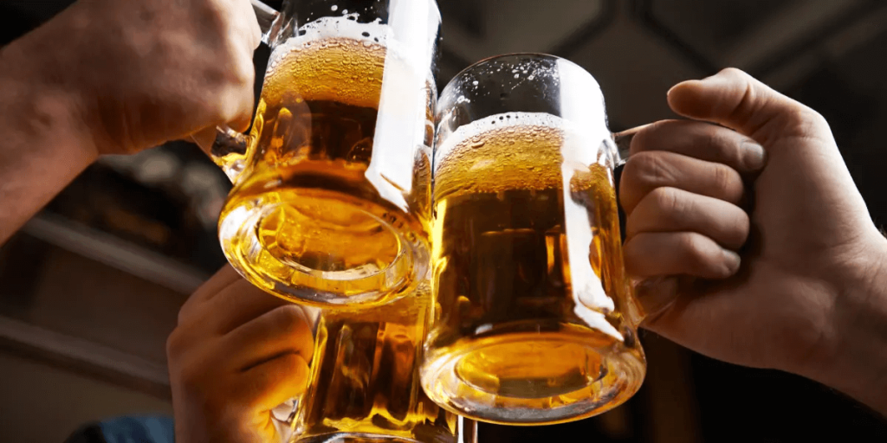

 

## **Introduction**

The world of beer reviews is rich with data, offering insights into consumer preferences and biases. The main goal of any rating app is to provide **objective scores**, helping users navigate a world of choices. However, ratings are inherently **subjective**, shaped by the biases and perceptions of reviewers.

In this data story, we explore the various biases that influence beer ratings, ranging from **time-related trends** to **cultural and naming biases**. By identifying these influences, we propose adjustments that enhance the objectivity and accuracy of ratings.

---

## **The Key Questions**

Our analysis focuses on the following critical questions:

1. **Temporal Trends**: How do ratings change over time? Are there seasonal variations or spikes linked to events or holidays?  
2. **Anchoring Effects**: Do early ratings significantly impact subsequent ones? Are reviewers biased by the first few scores?  
3. **Cultural Biases**: Do reviewers rate domestic beers more favorably than international ones? How does beer consumption per capita influence ratings?  
4. **Naming Bias**: Does a beer's name set expectations that influence its rating?

---

### **Datasets**
1. **BeerAdvocate Dataset**: Comprising ratings, user information, and brewery details.  
2. **Beer Consumption Data**: Total and per capita beer consumption by country (sourced from World Population Review).  

---

# **1. Time Bias : Influence of time on the ratings**

In this part we will analyse the time bias in the ratings, how the time influence the final ratings of beer. We see the evolution through the years but also the difference at some special period, specifically the Christmas and new year period and the Oktoberfest period.

First we look at different style of beer and how they evolve through the years. We start by looking only on the rateBeer dataset, to reduce redundant plot, as both are he same for these plot.

  

 

They all start with a high variance in the ratings, but as the years go by, the ratings tend to converge to a certain value. The high rated seams to go down, and the low rated seams to go up. globally they are quite stable. Let's test some more style to confirm.

  

 

We see that the second sample of style follow the same rule as the first one. The ratings tend to converge to a certain value. The high rated seams to go down, and the low rated seams to go up. We will try to explain this with more researches. We note that the global rating for all beer for the last two years is 3.41.

Here we will see what and how much the year the month and the day affect the rating for both dataset.

*The logistic regression analysis of the rating on the RateBeer dataset gives :*

<body>
    <table>
        <thead>
            <tr>
                <th>Parameter</th>
                <th>Coefficient</th>
            </tr>
        </thead>
        <tbody>
            <tr>
                <td>Year</td>
                <td>0.0549</td>
            </tr>
            <tr>
                <td>Month</td>
                <td>-0.0013</td>
            </tr>
            <tr>
                <td>Day</td>
                <td>0.0003</td>
            </tr>
        </tbody>
    </table>
</body>

*The logistic regression analysis of the rating on the BeerAdvocate dataset gives :*

<body>
    <table>
        <thead>
            <tr>
                <th>Parameter</th>
                <th>Coefficient</th>
            </tr>
        </thead>
        <tbody>
            <tr>
                <td>Year</td>
                <td>0.0428</td>
            </tr>
            <tr>
                <td>Month</td>
                <td>-0.0032</td>
            </tr>
            <tr>
                <td>Day</td>
                <td>-0.0002</td>
            </tr>
        </tbody>
    </table>
</body>

We can see for both dataset that the year has a significant impact on the rating, the month and the day have a less significant impact. With little more impact on the RateBeer dataset.

Now we will compare the average rating per year for all beer and see there evolution as we know the year affect much. We add an error bar using the standard deviation. We test this for both dataset to see the difference. We also look at how many rating have been given for each year.

The plot on the left show the average rating per year, on the right it is the same plot but with the standard deviation.

__*For the RateBeer dataset (the graduation are not the same on both plot)*__

  
  

 

__*For the BeerAdvocate dataset (the graduation are not the same on both plot)*__

  
  

 

__*Number of ratings*__

  

 

The first year are not determinant as the number of review are very low, we will only focus on the data from 2001 for RateBeer and 2002 for BeerAdvocate. In these 5 plot we can see the that for both datasets the average ratings goes up through the year. The standard deviation goes down for both. We also see a big increase in the number of review through the year, with a downfall for BeerAdvocate from 2011. This mean the rating for the beer are growing more similar threw the time, and a little better. This can be explained by different bias that we look into in this research.

To deepen ours analysis on the time bias, we will compare the ratings during the Christmas and new year period and the Oktoberfest period with the rest of the year to see if there is a difference. These two moment are holidays were people goes out much and drink lots of beer.

__*For the RateBeer dataset*__

  
  

 

__*For the BeerAdvocate dataset*__

  
  

 

We see that on both dataset, the holidays rating are a little higher and there are more rating done, this could be because there a more people drinking and having time to review, and in a better environment this make them give slightly better result. As oppose for the Oktober fest period were it seam to have no influence, the fest are not famous enough in the whole world and only in some country to make a sufficient impact. There seam even that there are less review at that time, it could be a busy period for the people not concerned by the holiday.

---

# **2. Anchoring Effect : Impact of early ratings**

The [anchoring effect](https://en.wikipedia.org/wiki/Anchoring_effect) is a well-known cognitive bias that influences people's judgment based on prior opinions or information they encountered. This effect is present in everyone’s life, often without being noticed. The brain tends to rely on the first information it receives, which greatly influences the final judgment of everyone. For well-known items, this can lead to significant bias. If majority's opinions are influenced by the anchoring effect, then the item's perceived value might be skewed. Popular items may experience strong anchoring effects, potentially leading them to be highly overrated.

On BeerAdvocate and RateBeer, anyone can submit ratings. As some popular beers have a large number of ratings, one might think that the Wisdom of the Crowds applies and that the ratings are representative. However, to write a review, one must visit the website and will inevitably see the current rating of the beer, along with a list of the most recent ratings and comments. So anyone rating a beer will be confronted with others' opinions, which introduces a slight bias due to the anchoring effect.

The goal of our analysis is be to observe and potentially measure this anchoring effect on the beer rating for both BeerAdvocate and RateBeer websites.

To analyse the anchoring effect, we will first examine the __data__ !
In this case, it is usefull to study the distribution of the ratings, ordered by date, for each beer. 
As the plots appear to be noisy, we perform a moving average to smooth the data.
Then by analysing the plots of this distribution for individual beer, we observe a strange phenomena. When the first ratings are extreme values, either very high or very low, the following rating seems to be more nuanced and closer to the mean (which is 3).

If the initial ratings are very high, they tend to decrease over time, and if they are low, they tend to increase with time.
Below are two carefully selected examples that illustrate perfectly this tendency:

__*Ratings distribution over time for representative beers*__

  
  

 

On these specific plots we can see that the first ratings are highly biased, or at least very categorical. And this seem to appear on many beers. To see if the tendency really exists on every beer, we will plot the mean distance between the overall rating and the mean rating (of 3) for every popular beer.
We only took the popular beers, because our analysis directly depends on the total number of ratings and we need many of them to observe any tendency over time. As before the graph is noisy, so we smooth it using a moving average.
Below are these two plots, for RateBeer and BeerAdvocate respectively.

__*Average distance to the mean of ordered ratings*__

  
  

 

On these graphs we can see that the first ratings are on average more distant from the average rating of 3 than the following ones. We also observe that the ratings coming just after the first ones also tends to be higher than 3 but then decrease with time.
This might be due to the Anchoring effect, but it can also just be due to the fact that the most enthusiastic or critical individuals are usually giving their rating first !

By plotting a histogram of the distributions of the first ratings and the overall ratings for every beer, we observe that the first ratings tends to be greater, which correlates with the hypothesis that more enthusiastic people tend to give their rating first.

__*Distribution of first ratings and overall final rating*__

We can also consider the regression to the mean effect, rating tends to naturally move close to the average, 3 in this case, and this is due to the fact that the first rating is often highly biased by special circumstances, emotions or by the novelty of the beer. 

To see if the anchoring effect has an influence on the final rating of the beer, we want to search for a correlation between the first rating and the overall rating. 
To do that, we perform a Pearson correlation test with null hypothesis telling that there is no correlation between the first rating and the final mean of the rating. The test tells us that there is a significant correlation of 0.683 (p value < 0.05). 
We can illustrate this correlation by making a joint plot of both first rating and the mean of every other rating on every beer. This illustration highlights the correlation between both distributions.

__*Correlation between the first ratings vs overall final rating distributions*__

The absence of any correlation would have suggested the absence of any anchoring effect, but this correlation alone doesn’t prove anything for sure as both the first rating and the mean rating concern the same beer and may be influenced by similar factors. 

To prove the presence of any Anchoring Effect we need  to have a rating for every beer that is representative and unbiased, in order to see if the overall rating is influenced or not. 
On the BeerAdvocate website, there is the bros score. This score has been given by the creator of the website that have experience with beers, so they shouldn't be influenced by any Anchoring Effect, so we will assume that this score is representative of the beer quality for our analysis.

The idea to observe Anchoring Effect would is to split the website rating in two groups :
- A first group that have a very high first rating
- A second group that has a very low first rating

The anchoring effect would act differently between the two groups, in the first group the overall rating would be __above__ the objective rating (or bros score), and in the second group, the overall of final rating would be __below__ the bros score.

By doing so, we obtained the following results :

__*Difference between the overall ratings and bros scores for both groups*__

We can see on this graph that the rating differs from the bros score as expected according to the Anchoring Effect.
For the group with high first ratings, the overall rating mean is slightly above by about `0.04` which is negligible. 
But for the second group the difference is higher, around `0.17` points lower than the bros score.

The observed Anchoring effect it really small, so these differences might be only due to randomness in the rating.
To prove it is not the case, we perform a T-Test with the null hypothesis being that both rating do not differ significantly.
This statistical test results were a T-statistic of `4.02` and a P-value of `0.00`. This means that the difference between the bros score and the overall final rating is significant, so we conclude that we might have observed the effect of the Anchoring effect, but it has a really small imparct on the final ratings.

---

# **3. Cultural Bias : Impact of the origine of the beer**

So, we found that there is indeed a small but existing Anchor bias in the beer ratings. But what about cultural biases ?
Indeed, it wouldn't be surprising that beers rated by people from the same country as where they were created are more
generously rated than the others.  

We'll first check whether people who rate beer that come from their country, give more generous notes or not when rating the beer.
We'll call them, respectively, domestic and international raters.  

Let's plot ratings frequencies of both domestic (treatment group) and international (control group) raters!

__*Treatment and control group rating frequencies with KDE curves (BeerAdvocate left and RateBeer right)*__

  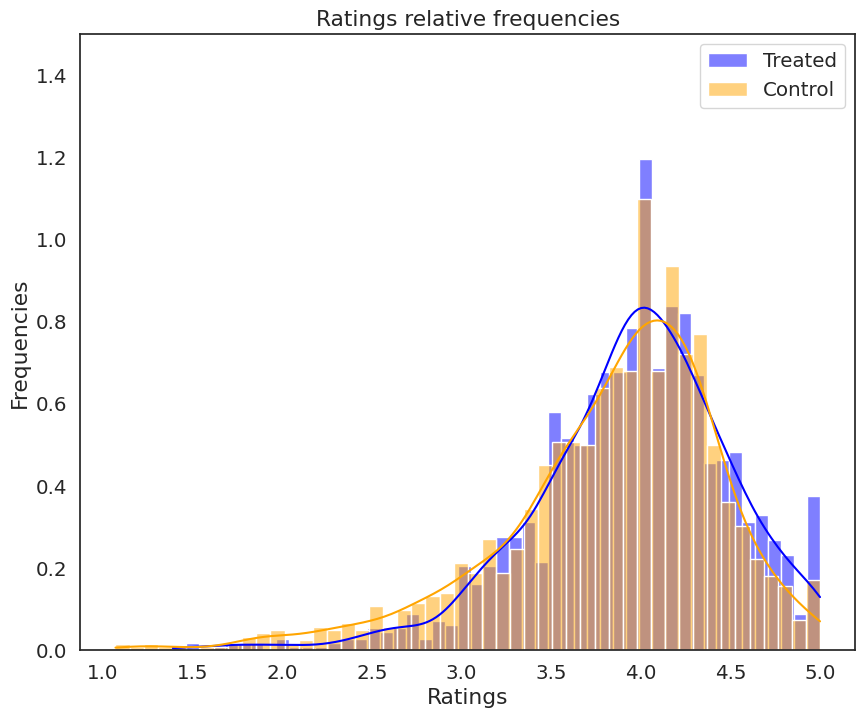
  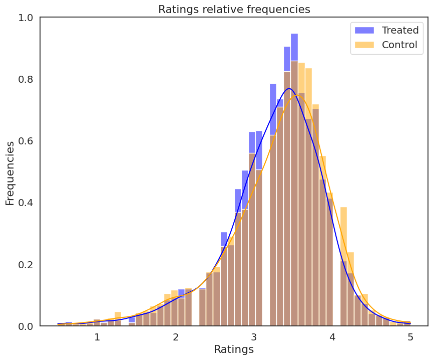

 

We see that the distributions are pretty similar, but in both of them a slight shift between the domestic and international ratings can be seen.
On the BeerAdvocate data, domestic reviewers seem to have slightly higher ratings, but we notice the inverse for RateBeer.
We can't be sure just by looking at the histograms. Maybe a plot of the means and basic statistics can give us some more insight.

__*Treatment and control group statistics with bootstrapping error bars for the mean (BeerAdvocate left and RateBeer right)*__

  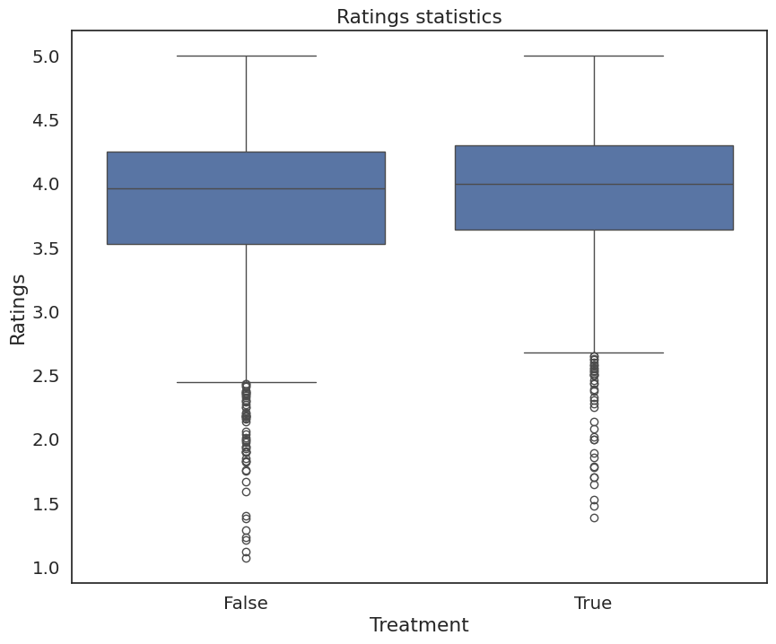
  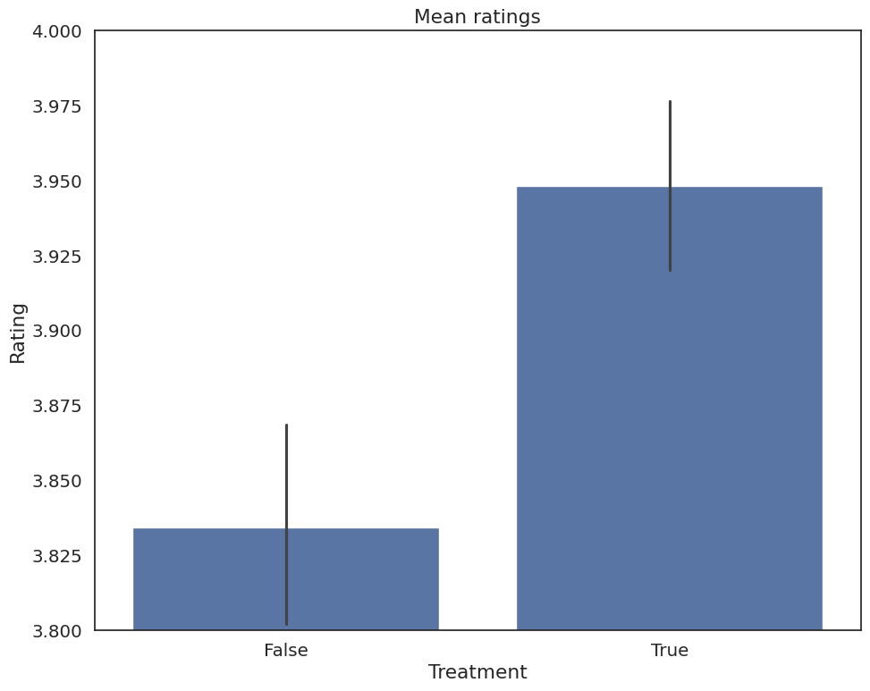
  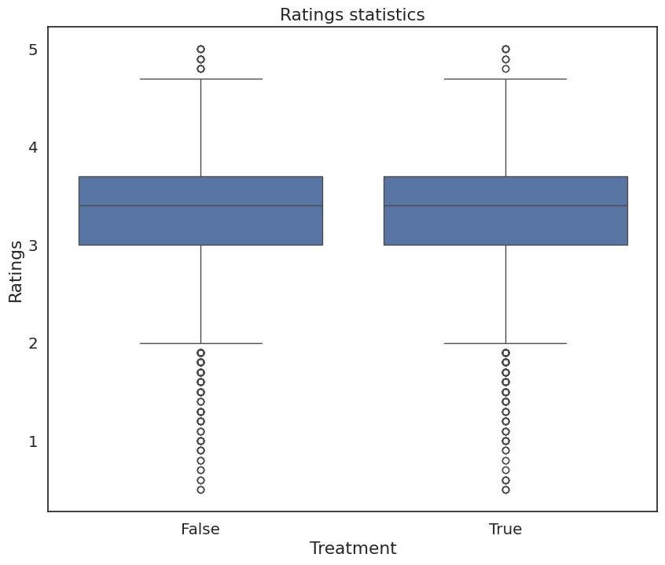
  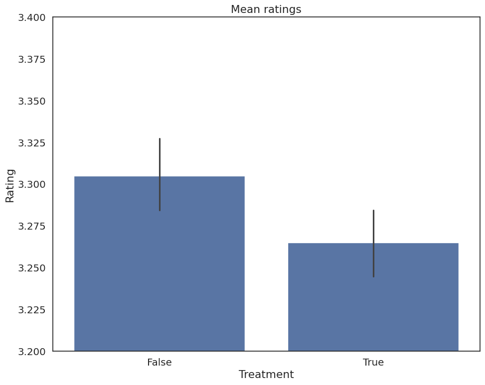

 

The median for BeerAdvocate is slightly higher for the domestic raters and the mean is about 0.1 higher. However, the 
quantiles are more or less the same for RateBeer and the international raters' mean looks higher than the domestic raters.
Although the means' error bars are overlapping so they might just be also very similar.  

It seems like there is a small positive impact on the rating when people come from the sample place as the beer in the
BeerAdvocate data, but the results tend to show that there is no impact in the RateBeer data. Let's try fitting a
linear model to both datasets with the ratting as the dependant variable and see the influence of each feature of the data.

__*Linear regression coefficients (BeerAdvocate left and RateBeer right)*__

  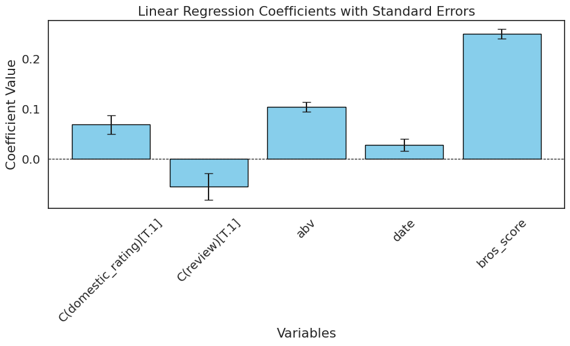
  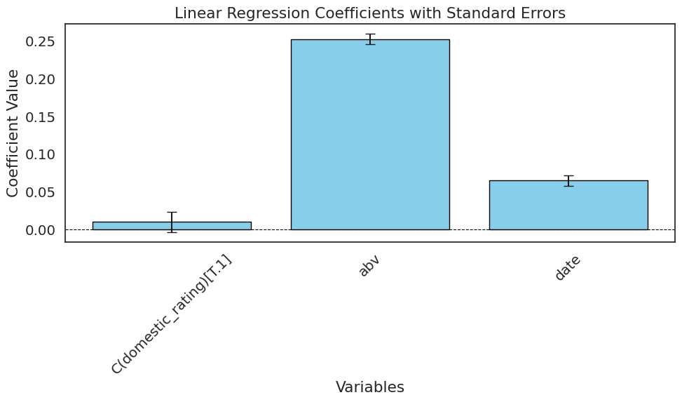

 

We see that the for BeerAdvocate, the domestic ratings, the alcohol by volume, the date when the rating was posted and
"Brothers' score" (the two founders of BeerAdvocate) have a positive impact on the rating, but when people post a review 
with the rating, it's rating tends to be lower. We can see the same behaviour for RateBeer (minus the review and bros_score
which are only on BeerAdvocate). There are quite large error bars for the domestic_rating variable for RateBeer, so again
it's hard to say if domestic ratings influence the ratings for this data.  

This a bit disappointing... Results show that there might not be a real difference between domestic and international ratings
after all.

---

# **4. Naming Bias: What's in a Name?**

When it comes to the enjoyment of drinking a beer, how much does the label impact us? This is a question that merges psychology, 
branding and consumer behaviour. Beer names can vary wildly from classic descriptions of the beer and its brewery (Speedway IPA), 
to quirky and unique names (Hopportunity). These names were selected for a reason, and as consumers, the name is the first thing that we see. 
Does this cause some sort of priming where certain names raise or lower our expectation of a beer and thus the likelihood that we rated it higher or lower?

First of all, what do typical beer names look like? Below is a wordcloud of the most common terms found in beer names for 
BeerAdvocate and RateBeer respectively:

__*BeerAdvocate Word cloud and RateBeer word cloud*__

  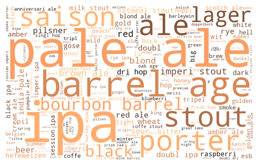
  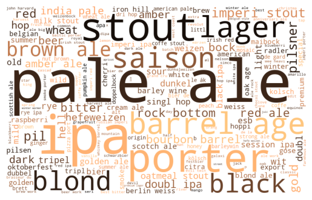

 

When analyzing beer names, and as demonstrated by the word clouds above, we first noticed that the most common words refer 
to the beer’s style or its brewery. Specifically, **41.87%** of beer names on BeerAdvocate and **38.13%** on RateBeer ave some 
mention of the beer’s style, while **14.30%** on BeerAdvocate and a striking **89.35%** on RateBeer mention the brewery. 
Given the high prevalence of these references—especially brewery names on RateBeer—we exclude them from our keyword analysis 
moving forward to focus on more unique and meaningful terms that might better capture the impact of naming on ratings.

## Average Rating per Keyword

We begin our analysis by studying the impact of specific words within a beer’s name. By tokenizing beer names and stemming 
words to group similar forms together, we can observe the average rating that beers containing such a word have obtained. 
We initially limit our analysis to the most common words, that have at least 100 beers that use them. For Beer Advocate, 
we find the following ten best and worst rated keywords:

__*10 best and worst word in Beer Advocate*__

  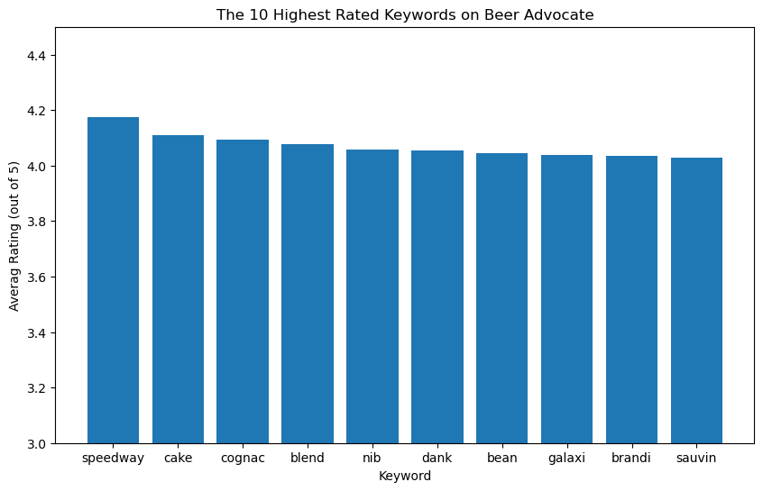
  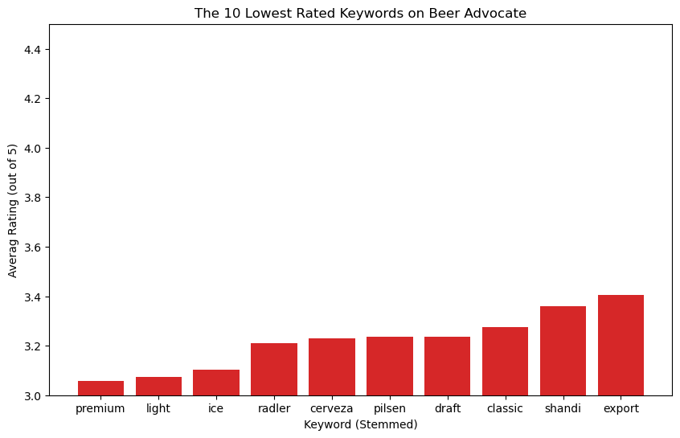

 

And for Rate Beer:

__*10 best and worst word in Rate Beer*__

  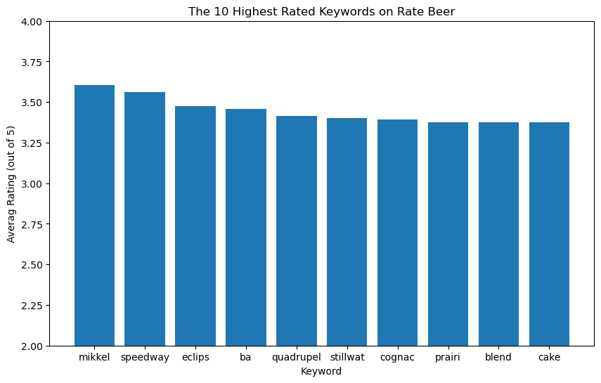
  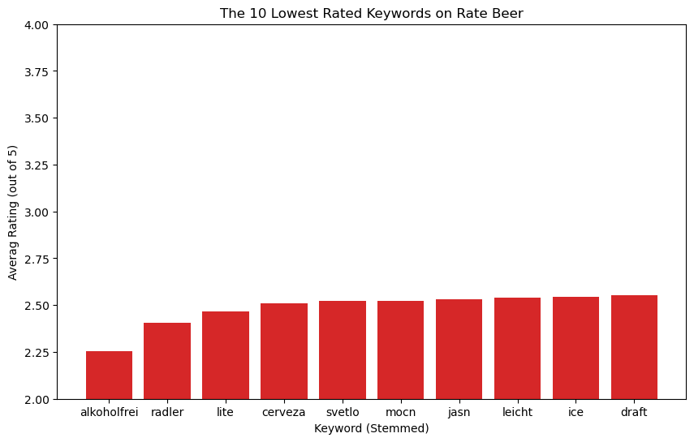

 

The biggest takeaway from this analysis is that the choice of keywords in beer names strongly correlates with average ratings, 
and these correlations seem to cluster into thematic groups that reflect consumer expectations and preferences. By grouping these keywords, 
we can better understand the types of associations they evoke and how they might prime a drinker’s experience.

### Keywords Associated with High Ratings

The highest-rated beers often include words that evoke indulgence, craftsmanship, or exclusivity. These can be grouped into several themes:

#### 1. Barrel-Aging and Blending

Terms like “blend”, “brandi”, “cognac” , and “ba” (short for barrel-aged) suggest techniques associated with high-end or 
experimental brewing. These processes are often perceived as elevating a beer’s complexity and depth, potentially leading to higher ratings.

#### 2. Dessert-Like Flavors
    
Words like “cake”, “bean” (linked to vanilla or coffee), and “nib” (cacao nibs) suggest rich flavors. 
These terms align with consumer preferences for dessert-inspired beers.

#### 3. Exotic Hops
    
Terms such as “galaxi”, "dank" and “sauvin”, which reference specific hop varieties, hint at the use of rare or premium ingredients. 
This resonates with craft beer enthusiasts who value innovation and distinctive flavor profiles.

#### 4. Craft and Independent Branding
    
Names like “speedway” and “mikkel” are tied to well-regarded craft breweries. 
These words carry brand-specific associations that can elevate consumer expectations.

### Keywords Associated with Low Ratings

On the other end of the spectrum, the lowest-rated beers often include terms that suggest simplicity, 
mass production, or lower-quality offerings. These terms can be grouped as follows:

#### 1. Mass-Market Appeal
    
Words like “premium”, “light”, “ice”, and “draft” are commonly associated with large-scale commercial beers. 
These beers are often perceived as less complex or distinctive, which may lead to lower ratings.

#### 2. Mixes or Low-Alcohol Styles
    
Terms like “radler,” “shandi,” and “alkoholfrei” refer to lighter, often fruit-infused or alcohol-free beverages. 
While these styles have their niche, they are not typically associated with the depth and richness favored by craft beer enthusiasts.

#### 3. Generic Branding
    
Words such as “cerveza” and “classic” evoke a traditional or straightforward image. This simplicity may not excite consumers looking for novelty or creativity.

The analysis highlights how a beer’s name is tied to certain expectations, and what the average reviewer on the platform tends to prefer. 
Words linked to indulgence, rarity, or craftsmanship tend to prime consumers to expect—and potentially rate—a better experience, 
whereas names tied to mass production or simplicity might lower expectations and ratings. While it is not made evident that the label causes higher/lower ratings, 
it is certain that reviewers are more responsive to complex flavors and techniques than the typical available beers most people enjoy.

## Descriptive Names vs Non-Descriptive Names

As seen before, most beer names are quite descriptive. They clearly present the beer's style and/or brewery. 
But perhaps people prefer more creative names instead? To explore whether including the beer style or brewery name impacts ratings, 
we compared beers with and without these descriptors across all beers and specific styles like lagers (which is a keyword that tends to have lower average ratings). 
While a t-test revealed a statistically significant difference, the effect was minuscule and inconsistent between datasets: one showed a slight positive effect, 
and the other a slight negative. This suggests that including style or brewery names in the beer’s name does not meaningfully influence its rating.

---

## **Conclusion**

This analysis reveals multiple biases influencing beer ratings, including temporal trends, anchoring effects, cultural preferences, and naming influences. 
Addressing these biases through normalization, weighting adjustments, and anonymization can lead to more objective and reliable ratings, ultimately benefiting consumers and breweries alike.

---
