# **The Biases Behind Rating: Uncovering the Hidden Influences in Beer Ratings**

## **Introduction**

The world of beer reviews is rich with data, offering insights into consumer preferences and biases. The main goal of any rating app is to provide **objective scores**, helping users navigate a world of choices. However, ratings are inherently **subjective**, shaped by the biases and perceptions of reviewers.

In this data story, we explore the various biases that influence beer ratings, ranging from **time-related trends** to **cultural and naming biases**. By identifying these influences, we propose adjustments that enhance the objectivity and accuracy of ratings.

---

## **The Key Questions**

Our analysis focuses on the following critical questions:

1. **Temporal Trends**: How do ratings change over time? Are there seasonal variations or spikes linked to events or holidays?  
2. **Anchoring Effects**: Do early ratings significantly impact subsequent ones? Are reviewers biased by the first few scores?  
3. **Cultural Biases**: Do reviewers rate domestic beers more favorably than international ones? How does beer consumption per capita influence ratings?  
4. **Naming Bias**: Does a beer's name set expectations that influence its rating?

---

## **Datasets and Methodology**

### **Datasets**
1. **BeerAdvocate Dataset**: Comprising ratings, user information, and brewery details.  
2. **Beer Consumption Data**: Total and per capita beer consumption by country (sourced from World Population Review).  

### **Methodology**
- **Temporal Analysis**: Ratings were aggregated by month and year to identify patterns and trends.  
- **Anchoring Effect**: Correlation tests (Pearson and Spearman) were used to evaluate the relationship between early and subsequent ratings.  
- **Cultural Bias**: Domestic and international ratings were compared using t-tests and mean comparisons, and their correlation with beer consumption was assessed.  
- **Naming Bias**: Text analysis and Chi-square tests were used to evaluate the impact of beer names on ratings.

---

## **Findings**

### **Influence of time on the ratings**

In this part we will analyse the time bias in the ratings, how the time influence the final ratings of beer. We see the evolution through the years but also the difference at some special period, specifically the Christmas and new year period and the Oktoberfest period.

First we look at different style of beer and how they evolve through the years. We start by looking only on the rateBeer dataset, to reduce redundant plot, as both are he same for these plot.
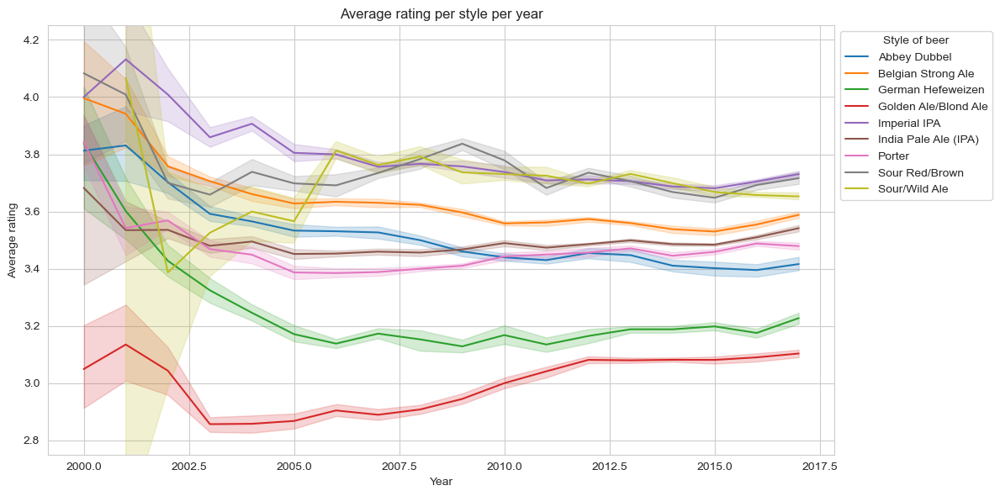
They all start with a high variance in the ratings, but as the years go by, the ratings tend to converge to a certain value. The high rated seams to go down, and the low rated seams to go up. globally they are quite stable. Let's test some more style to confirm.
 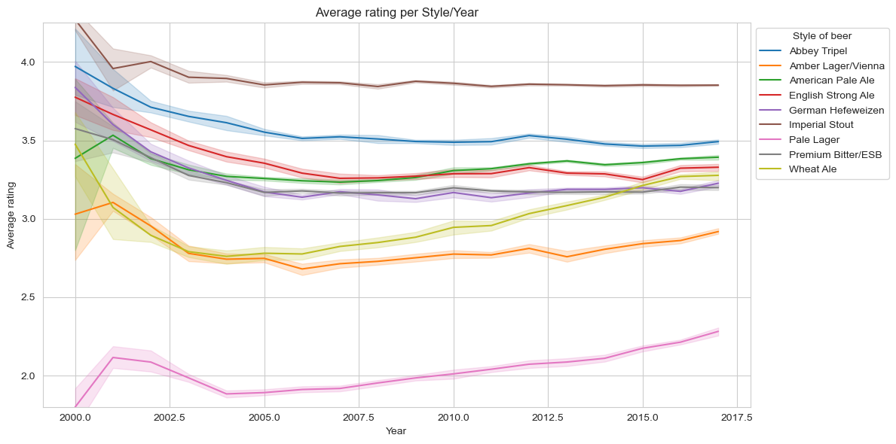
We see that the second sample of style follow the same rule as the first one. The ratings tend to converge to a certain value. The high rated seams to go down, and the low rated seams to go up. We will try to explain this with more researches. We note that the global rating for all beer for the last two years is 3.41.

Here we will see what and how much the year the month and the day affect the rating for both dataset.

We can see for both dataset that the year has a significant impact on the rating, the month and the day have a less significant impact. With little more impact on the RateBeer dataset.

Now we will compare the average rating per year for all beer and see there evolution as we know the year affect much. We add an error bar using the standard deviation. We test this for both dataset to see the difference. We also look at how many rating have been given for each year.

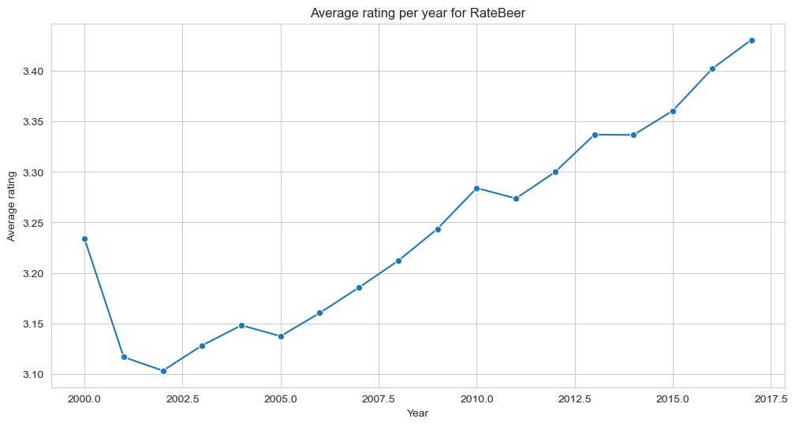

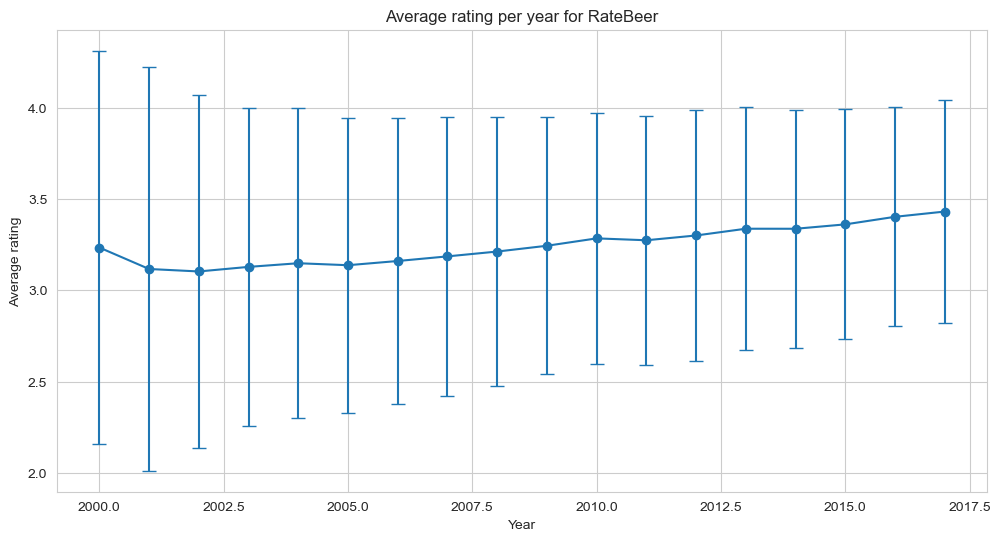

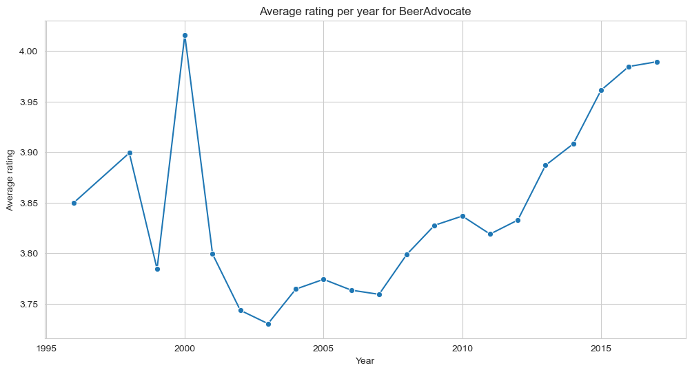

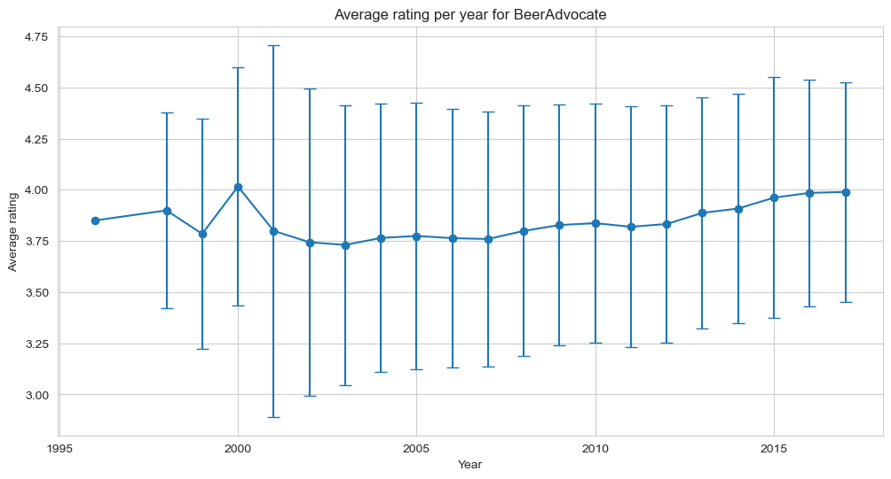

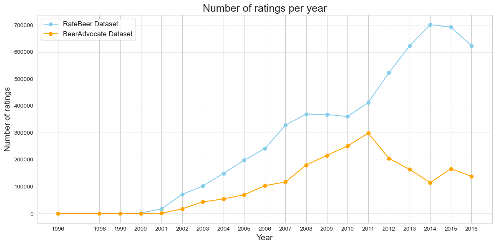

The first year are not determinant as the number of review are very low, we will only focus on the data from 2001 for RateBeer and 2002 for BeerAdvocate. In these 5 plot we can see the that for both datasets the average ratings goes up through the year, from 3.10 to 3.43 for RateBeer and 3.74 to 3.98 for beerAdvocate. The standard deviation goes down for both. We also see a big increase in the number of review through the year, with a downfall for BeerAdvocate from 2011. This mean the rating for the beer are growing more similar threw the time, and a little better. This can be explained by different bias that we look into in this research.

To deepen ours analysis on the time bias, we will compare the ratings during the Christmas and new year period and the Oktoberfest period with the rest of the year to see if there is a difference. These two moment are holidays were people goes out much and drink lots of beer.

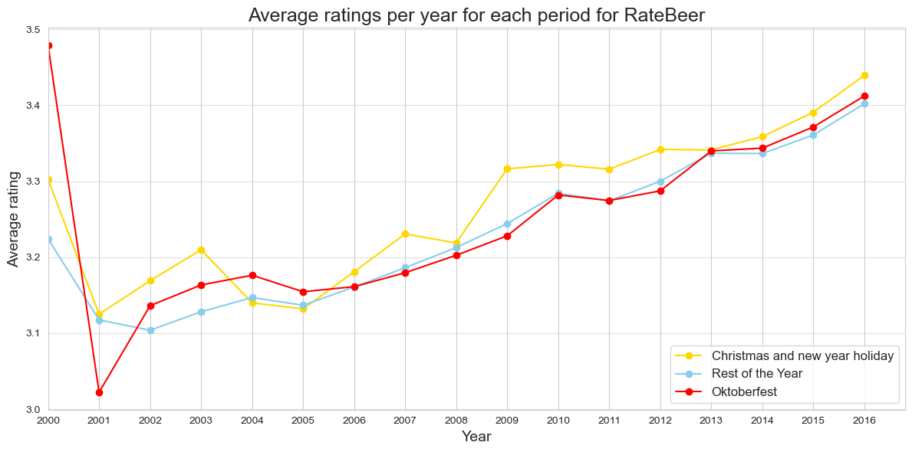

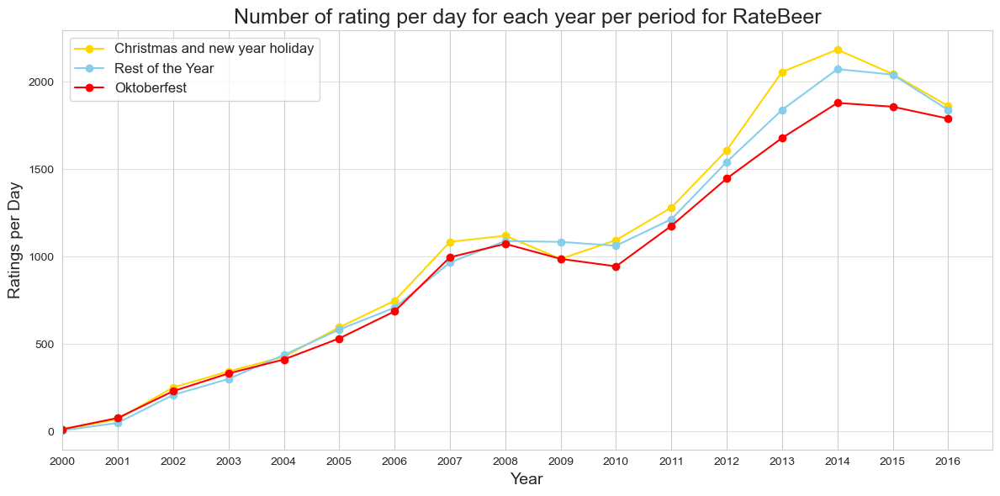

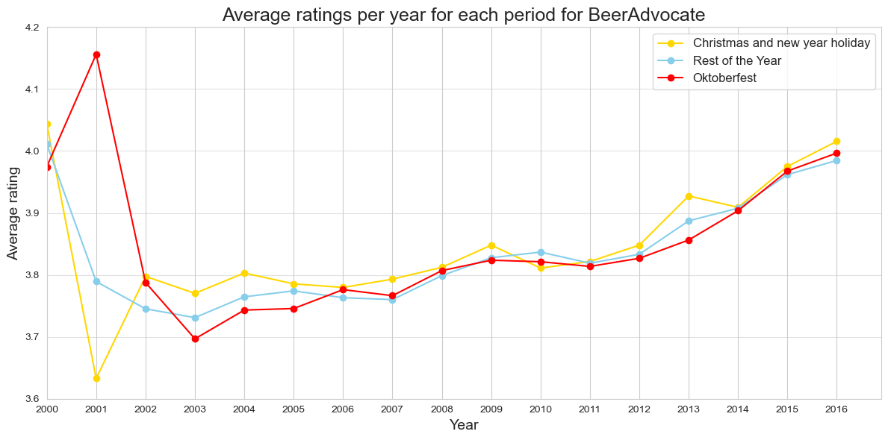

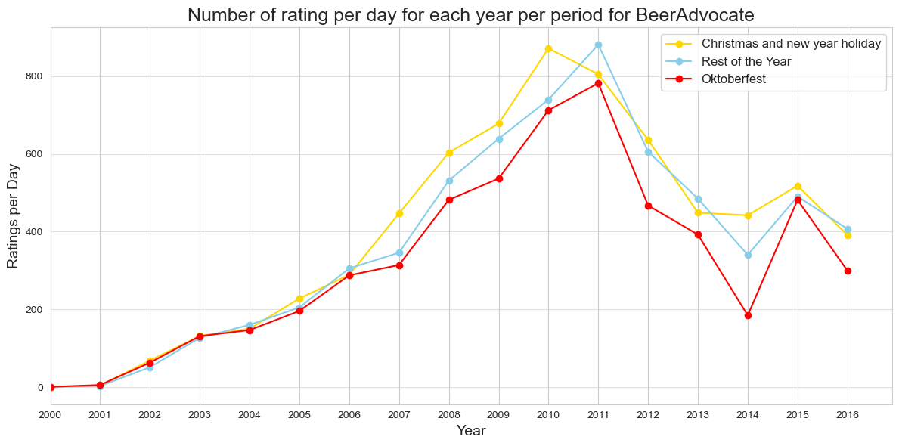

We see that on both dataset, the holidays rating are a little higher and there are more rating done, this could be because there a more people drinking and having time to review, and in a better environment this make them give slightly better result. As oppose for the Oktober fest period were it seam to have no influence, the fest are not famous enough in the whole world and only in some country to make a sufficient impact. There seam even that there are less review at that time, it could be a busy period for the people not concerned by the holiday.

---

#### **Figure 2: BeerAdvocate Dataset**

**Observation**:  
A spike in 2000 (rating > 4.0) is followed by a sharp decline, with steady growth post-2005.

**Analysis**:  
- **Spike in 2000**: Early adopters may have rated generously, or the sample size was small.  
- **Recovery**: Ratings post-2005 reflect better beer quality and consumer preferences.  
- **Comparison**: BeerAdvocate data exhibits more fluctuations than Ratebeer.

---

### **2. Anchoring Effect**

The [anchoring effect](https://en.wikipedia.org/wiki/Anchoring_effect) is a well-known cognitive bias that influences people's judgment based on prior opinions or information they encountered. This effect is present in everyone’s life, often without being noticed. The brain tends to rely on the first information it receives, which greatly influences the final judgment of everyone. For well-known items, this can lead to significant bias. If majority's opinions are influenced by the anchoring effect, then the item's perceived value might be skewed. Popular items may experience strong anchoring effects, potentially leading them to be highly overrated.

On BeerAdvocate and RateBeer, anyone can submit ratings. As some popular beers have a large number of ratings, one might think that the Wisdom of the Crowds applies and that the ratings are representative. However, to write a review, one must visit the website and will inevitably see the current rating of the beer, along with a list of the most recent ratings and comments. So anyone rating a beer will be confronted with others' opinions, which introduces a slight bias due to the anchoring effect.

The goal of our analysis is be to observe and potentially measure this anchoring effect on the beer rating for both BeerAdvocate and RateBeer websites.

To analyse the anchoring effect, we will first examine the __data__ !
In this case, it is usefull to study the distribution of the ratings, ordered by date, for each beer. 
As the plots appear to be noisy, we perform a moving average to smooth the data.
Then by analysing the plots of this distribution for individual beer, we observe a strange phenomena. When the first ratings are extreme values, either very high or very low, the following rating seems to be more nuanced and closer to the mean (which is 3).

If the initial ratings are very high, they tend to decrease over time, and if they are low, they tend to increase with time.
Below are two carefully selected examples that illustrate perfectly this tendency:

__*Ratings distribution over time for representative beers*__

  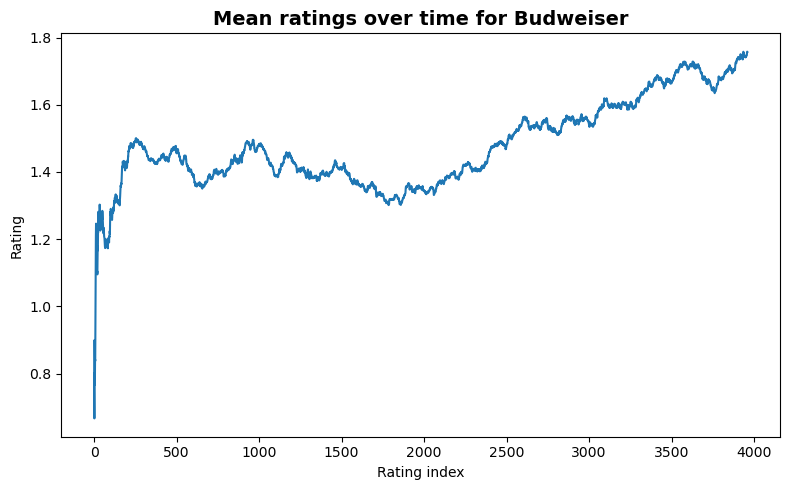
  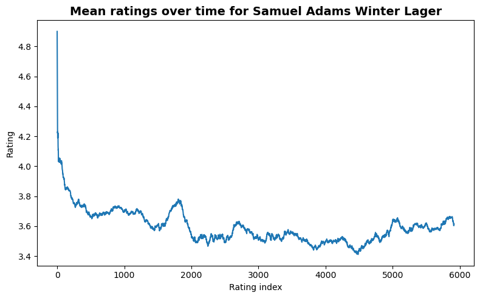

 

On these specific plots we can see that the first ratings are highly biased, or at least very categorical. And this seem to appear on many beers. To see if the tendency really exists on every beer, we will plot the mean distance between the overall rating and the mean rating (of 3) for every popular beer.
We only took the popular beers, because our analysis directly depends on the total number of ratings and we need many of them to observe any tendency over time. As before the graph is noisy, so we smooth it using a moving average.
Below are these two plots, for RateBeer and BeerAdvocate respectively.

__*Average distance to the mean of ordered ratings*__

  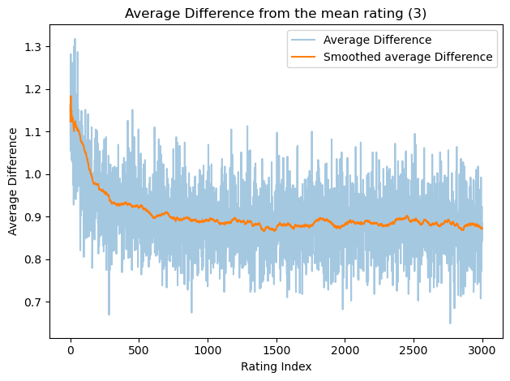
  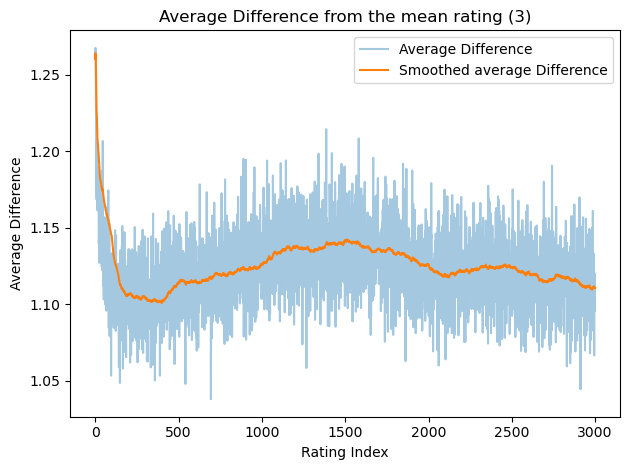

 

On these graphs we can see that the first ratings are on average more distant from the average rating of 3 than the following ones. We also observe that the ratings coming just after the first ones also tends to be higher than 3 but then decrease with time.
This might be due to the Anchoring effect, but it can also just be due to the fact that the most enthusiastic or critical individuals are usually giving their rating first !

By plotting a histogram of the distributions of the first ratings and the overall ratings for every beer, we observe that the first ratings tends to be greater, which correlates with the hypothesis that more enthusiastic people tend to give their rating first.

__*Distribution of first ratings and overall final rating*__

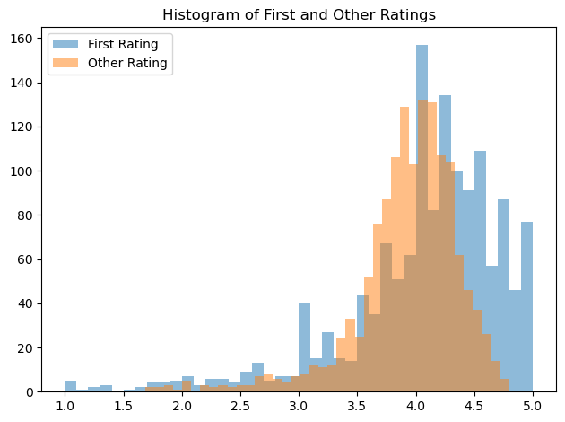

We can also consider the regression to the mean effect, rating tends to naturally move close to the average, 3 in this case, and this is due to the fact that the first rating is often highly biased by special circumstances, emotions or by the novelty of the beer. 

To see if the anchoring effect has an influence on the final rating of the beer, we want to search for a correlation between the first rating and the overall rating. 
To do that, we perform a Pearson correlation test with null hypothesis telling that there is no correlation between the first rating and the final mean of the rating. The test tells us that there is a significant correlation of 0.683 (p value < 0.05). 
We can illustrate this correlation by making a joint plot of both first rating and the mean of every other rating on every beer. This illustration highlights the correlation between both distributions.

__*Correlation between the first ratings vs overall final rating distributions*__

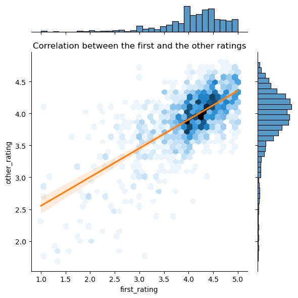

The absence of any correlation would have suggested the absence of any anchoring effect, but this correlation alone doesn’t prove anything for sure as both the first rating and the mean rating concern the same beer and may be influenced by similar factors. 

To prove the presence of any Anchoring Effect we need  to have a rating for every beer that is representative and unbiased, in order to see if the overall rating is influenced or not. 
On the BeerAdvocate website, there is the bros score. This score has been given by the creator of the website that have experience with beers, so they shouldn't be influenced by any Anchoring Effect, so we will assume that this score is representative of the beer quality for our analysis.

The idea to observe Anchoring Effect would is to split the website rating in two groups :
- A first group that have a very high first rating
- A second group that has a very low first rating

The anchoring effect would act differently between the two groups, in the first group the overall rating would be __above__ the objective rating (or bros score), and in the second group, the overall of final rating would be __below__ the bros score.

By doing so, we obtained the following results :

__*Difference between the overall ratings and bros scores for both groups*__

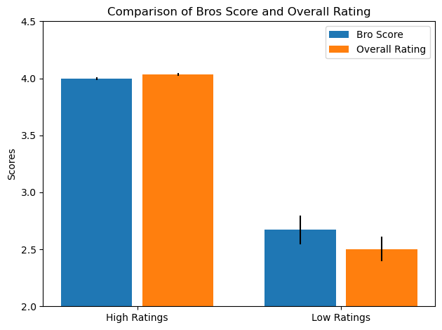

We can see on this graph that the rating differs from the bros score as expected according to the Anchoring Effect.
For the group with high first ratings, the overall rating mean is slightly above by about `0.04` which is negligible. 
But for the second group the difference is higher, around `0.17` points lower than the bros score.

The observed Anchoring effect it really small, so these differences might be only due to randomness in the rating.
To prove it is not the case, we perform a T-Test with the null hypothesis being that both rating do not differ significantly.
This statistical test results were a T-statistic of `4.02` and a P-value of `0.00`. This means that the difference between the bros score and the overall final rating is significant, so we conclude that we might have observed the effect of the Anchoring effect, but it has a really small imparct on the final ratings.

---

### **3. Cultural Bias**

#### **Figure 4: Histogram of Domestic Ratings**

**Observation**:  
Most domestic beers have fewer than **100 ratings**, with a steep decline and a long tail for popular beers.

**Analysis**:  
- **Bias in Domestic Ratings**: A few highly rated beers dominate the average.  
- **Recommendation**: Normalize data to account for less-rated beers.

---

#### **Figure 5: Histogram of International Ratings**

**Observation**:  
International beers exhibit a broader distribution, with many beers receiving **>1,000 ratings**.

**Analysis**:  
- **Popularity Disparity**: International beers have a wider consumer base.  
- **Recommendation**: Normalize data to enable fair comparisons between domestic and international ratings.

---

### **4. Naming Bias**

#### **Figure 6: Comparison Analysis**

**Observation**:  
First ratings are consistently higher than subsequent averages, indicating **optimism bias**.

**Analysis**:  
- **Expectation vs. Reality**: Higher initial ratings reflect enthusiasm or positive impressions from beer names.  
- **Recommendation**: Platforms could anonymize beer names during early reviews to reduce bias.

---

## **Key Insights**

1. **Temporal Trends**:  
   - Both datasets show an upward trend in ratings over time, influenced by industry growth and consumer preferences.  

2. **Anchoring Effect**:  
   - Early ratings bias subsequent reviews, requiring adjusted weightings for objectivity.  

3. **Cultural Bias**:  
   - Domestic beers receive more favorable ratings, reflecting cultural preferences.  

4. **Naming Bias**:  
   - Optimistic early ratings may be driven by beer names, suggesting anonymization as a potential solution.

---

## **Conclusion**

This analysis reveals multiple biases influencing beer ratings, including temporal trends, anchoring effects, cultural preferences, and naming influences. Addressing these biases through normalization, weighting adjustments, and anonymization can lead to more objective and reliable ratings, ultimately benefiting consumers and breweries alike.

---
